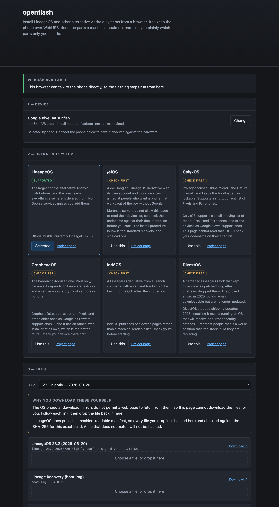
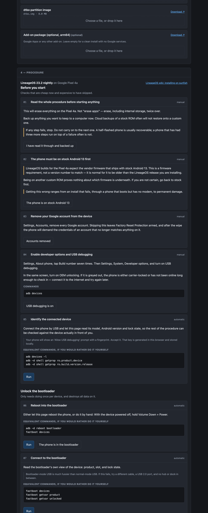

# openflash

> **AI-assisted project.** This codebase was created with [Claude](https://claude.com/claude-code)
> (Anthropic), directed and reviewed by a human author. It has been run **end to
> end on a Pixel 4a** — bootloader unlock through to a booted LineageOS 23.2 with
> MindTheGapps — and the plan generator is checked against all 733 devices in the
> LineageOS database. That is one device and one of the two install engines: the
> other 553 procedures come out of the same code but have never been run against
> the hardware they describe.

Install LineageOS and other alternative Android systems from a browser. It talks
to the phone over WebUSB, does the parts a machine should do, and tells you
plainly which parts only you can do.

**Live at [openflash.stoatworks-labs.com](https://openflash.stoatworks-labs.com).**
Deep links work: [`?device=sunfish&os=lineageos`](https://openflash.stoatworks-labs.com/?device=sunfish&os=lineageos)
opens straight onto the procedure for a Pixel 4a.

<table>
  <tr>
    <td align="center"><br><sub>pick a device, pick a system</sub></td>
    <td align="center"><br><sub>the procedure it generates for that pair</sub></td>
  </tr>
</table>

## What it does

**Autodetects the phone.** Plug it in and the page reads its codename, model,
Android version, security patch level, bootloader version, slot layout and lock
state — over ADB if it is booted, over fastboot if it is in the bootloader. If
the codename does not match the procedure you have selected, it refuses to
carry on rather than flash one device's build onto another.

**Generates the procedure for that exact device.** Not a generic guide with
"(on some devices)" scattered through it. The Pixel 4a gets its `dtbo` partition
step and its stock-Android-13 firmware requirement; a Xiaomi gets told that Mi
Unlock and a seven-day wait stand between it and anything else on the page; a
Samsung gets told this tool cannot flash it at all, because Odin is not fastboot.

**Runs the parts a machine should run.** Unlocking, flashing partitions,
`adb sideload` of the ROM zip — all over WebUSB, with progress. The parts only a
human can do — holding Volume Down, answering the phone's own unlock prompt,
picking "Format data" out of a recovery menu — are marked as such and wait for
you.

**Shows the equivalent commands anyway.** Every automated step prints the `adb`
and `fastboot` commands it stands in for. That is what makes the page useful in
Firefox and Safari, which have no WebUSB — you get a correct, ordered,
device-specific command list instead — and it is how you check what the page is
about to do before you let it.

**Verifies what you feed it.** LineageOS publishes a machine-readable build
manifest, so files you drop in are hashed in the page and checked against the
SHA-256 for that exact build. A file that does not match is not flashed.

## Devices

The device database is generated from the LineageOS wiki's own
[`_data/devices/*.yml`](https://github.com/LineageOS/lineage_wiki/tree/main/_data/devices),
which is what drives their install pages. That is 733 devices across 28 install
methods.

| | devices |
| --- | ---: |
| Full procedure generated | 554 |
| Not flashable from a browser (Odin, `dd`, APX, EDL, …) | 179 |
| …of the 554, unlocked by a fastboot command | 217 |
| …unlocked only through the vendor's own portal | 328 |
| …already unlocked, or no unlock step | 9 |

Regenerate after an upstream change:

```bash
npm run devices
```

## Systems

| | how it installs | what this tool knows |
| --- | --- | --- |
| **LineageOS** | recovery + sideload | Everything: live build list, exact filenames, sizes and SHA-256 per build |
| **/e/OS** | recovery + sideload | Procedure only — Murena's servers block browser reads, so bring your own files |
| **CalyxOS** | factory image zip | Procedure only, and their device list moves; check it first |
| **GrapheneOS** | factory image zip | Procedure only — and they have their own official web installer, which you should use instead |
| **iodéOS**, **DivestOS** | recovery + sideload | Via JSON profiles in `public/profiles/` |

Any other ROM can be added as a profile — a dozen lines of JSON naming the
project, its download page and which of the two engines it uses. No code.

## Running it

```bash
npm install && npm run dev
```

It is a static site with no server component, so `npm run build` produces
something you can drop on any static host. Deep links work:
`?device=sunfish&os=lineageos` opens straight onto the procedure for a Pixel 4a.

WebUSB needs Chrome, Edge, or another Chromium browser. Everything except the
flashing itself works everywhere.

**Stop your adb server first** — `adb kill-server`. A running adb server claims
any Android device the moment it appears and the browser is then refused the
same USB interface. It bites *after* the phone reboots into recovery, so the
step that fails is not the step that caused it.

Deploy: `cf-run npm run deploy` (a static-assets Worker, not a Pages project).

## Checks

```bash
npm run check
```

- **`check:sha256`** — the hand-written incremental SHA-256 against Node's
  `crypto`, at every length where the padding changes behaviour.
- **`check:unlock`** — every distinct unlock command in the database parses into
  something sendable. This caught a real bug: free-form fastboot commands go on
  the wire with spaces (`flashing unlock`), not colons, and two Nubia devices
  carry a three-line unlock sequence with a reboot in the middle.
- **`check:plans`** — a plan is generated for all 733 devices; no step may
  require a file the plan never asks for, no plan may reach a sideload without
  formatting data first.

None of that touches a phone, which is the limitation that matters. See below.

## Verified on hardware

**A Pixel 4a (`sunfish`), 2026-08-25, complete run:** device detection over ADB,
`fastboot flashing unlock`, `dtbo` flashed, Lineage Recovery flashed to `boot`,
data formatted, LineageOS 23.2 sideloaded, MindTheGapps sideloaded, first boot
into a working LineageOS. Every step driven from the page.

Two defects only a real handset could have found, both fixed in the process:

- **The USB interface was never released between transports.** The phone reboots
  between bootloader and recovery several times per install, and the handle from
  before the reboot still held the interface — so the next claim failed with
  `The device is already in used by another program`. A local `adb` server causes
  the identical symptom, which is why the error now leads with `adb kill-server`.
- **A silent hang on the add-ons step.** Add-on packages are not signed with the
  OS project's key, so recovery refuses the signature and waits on an *Install
  anyway?* prompt on the handset. The browser cannot see that prompt, and said
  nothing — so the page looked frozen while the phone was asking a question. It
  now reports how far the transfer got and where to look.

**What that does and does not cover.** One device, one vendor, one install
method (`fastboot_nexus`), one OS. The factory-zip engine — GrapheneOS, CalyxOS —
has never been run at all. The 553 other recovery-sideload procedures are
generated by the code that produced this one, which is a reason for some
confidence and not a substitute for trying it.

## What this is not

It is not a replacement for the LineageOS wiki. The wiki is the authority; this
page is generated from its data and links back to the page for your device on
every screen. Where the two disagree, the wiki is right and this is a bug.

It does not download ROMs for you, because it cannot: the mirrors send no CORS
headers, so a web page is not permitted to fetch from them. You download, you
drop the file in, the page checks it.

It will not pretend a vendor-locked bootloader is one command away.

## Licence

MIT. See [LICENSE](LICENSE) and [ATTRIBUTIONS.md](ATTRIBUTIONS.md).
